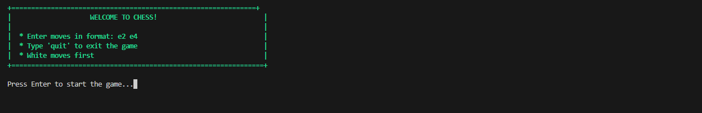
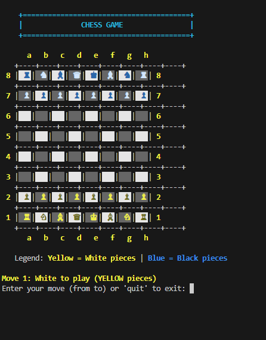
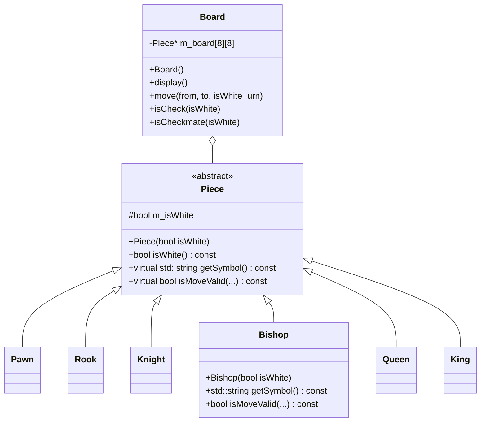

# C++ Chess Game

A modern object-oriented C++ chess implementation with a clean and visually appealing command-line interface. The game implements all standard chess rules including special moves and draw conditions.

## Screenshots

### Game Start Screen

### Chess Board Display

## Features

- Complete chess rules implementation:
  - Standard piece movement
  - Castling (kingside and queenside)
  - En passant captures
  - Pawn promotion
  - Check and checkmate detection
  - Stalemate detection
  - Threefold repetition draw
  - 50-move rule draw
  - Insufficient material draw

- Visual enhancements:
  - Unicode chess symbols
  - ANSI color support (colored pieces and alternating board squares)
  - Clean game interface with coordinates and legend

## Code Structure

- `include/` - Header files
  - `Piece.hpp` - Base piece class
  - `Board.hpp` - Chess board and game logic
  - Individual piece headers (Pawn.hpp, Rook.hpp, etc.)
  
- `src/` - Implementation files
  - `main.cpp` - Main game loop
  - `Board.cpp` - Board implementation with all chess rules
  - Individual piece implementations

## Class Structure

## Build Instructions

### Windows (MinGW-w64)

1. Make sure you have CMake and MinGW-w64 installed
2. Clone the repository
3. Create a build directory: `mkdir build`
4. Navigate to the build directory: `cd build`
5. Generate build files: `cmake -G "MinGW Makefiles" ..`
6. Build the project: `mingw32-make`
7. Run the game: `.\chess.exe`

### Linux

1. Make sure you have CMake and g++ installed
2. Clone the repository
3. Create a build directory: `mkdir build`
4. Navigate to the build directory: `cd build`
5. Generate build files: `cmake ..`
6. Build the project: `make`
7. Run the game: `./chess`

## How to Play

1. The game starts with the standard chess board setup
2. Enter moves in algebraic notation format: `e2 e4` (from square, to square)
3. Special moves like castling are handled automatically when you move the king two squares
4. For pawn promotion, you'll be prompted to choose a piece type (Q/R/B/N)
5. Type `quit` at any time to exit the game